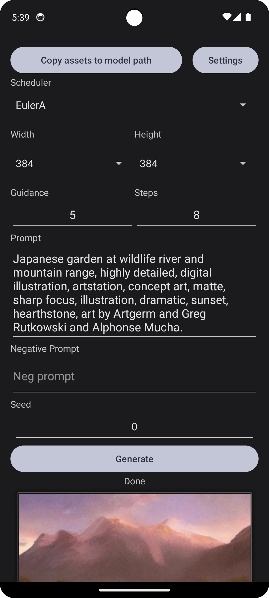
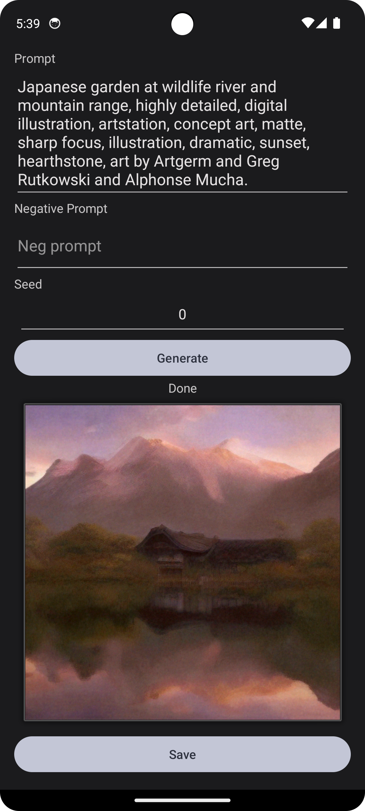

# Stable Diffusion on Android via ONNX

Use your Android phone to run Stable Diffusion.

## Features

- Inputs are stored alongside saved images via [exif](https://en.wikipedia.org/wiki/Exif).
- Partial translation for; (note, prompts must be in English)
    - Chinese Simplified
    - English

## Pre-built APKs

See [releases](https://github.com/Silic0nS0ldier/Android-Stable-diffusion-ONNX/releases) page.

## Build Instructions

1. Download assets from [`TIEMING/Chilloutmix` repo at Hugging Face](https://huggingface.co/TIEMING/Chilloutmix/tree/main).
2. Copy into `app/src/main/asserts/model/`.
3. Build with Android Studio (tested on 2022.3.1 Patch 4) or Gradle (i.e. `./gradlew ...`).

## Screenshots

    <figure>
        
        <figcaption>Default prompt 1 of 2</figcaption>
    </figure>
    <figure>
        
        <figcaption>Default prompt 2 of 2</figcaption>
    </figure>

## Credits

- [Runway](https://runwayml.com/), [CompVis](https://ommer-lab.com/) and [Stability AI](https://stability.ai/), for creating Stable Diffusion.
- Stability AI, who have continued development.
- [Microsoft](https://www.microsoft.com/) for creating [ONNX Runtime](https://onnxruntime.ai/).
- [Qualcomm](https://www.qualcomm.com/) who did this [first](https://www.qualcomm.com/news/onq/2023/02/worlds-first-on-device-demonstration-of-stable-diffusion-on-android), and is the source of the default prompt.
- [`@ZTMIDGO`](https://github.com/ZTMIDGO) who reproduced Qualcomm's research and made the results accessible.

## Related

It is unclear if these sources have been used to create this app, they are linked here just in case. This also helps improve discoverability of projects/research in the same area.

- [`ClashSAN/stable-diffusion-android-cpu-steps`, model optimisation notes](https://github.com/ClashSAN/stable-diffusion-android-cpu-steps)
- [`EdVince/stable-diffusion-ncnn`, implemented with ncc framework for Windows and Android](https://github.com/EdVince/stable-diffusion-ncnn)
- [`Yang-013/Stable-diffusion-Android-termux`, running on Android via termux](https://github.com/Yang-013/Stable-diffusion-Android-termux)
